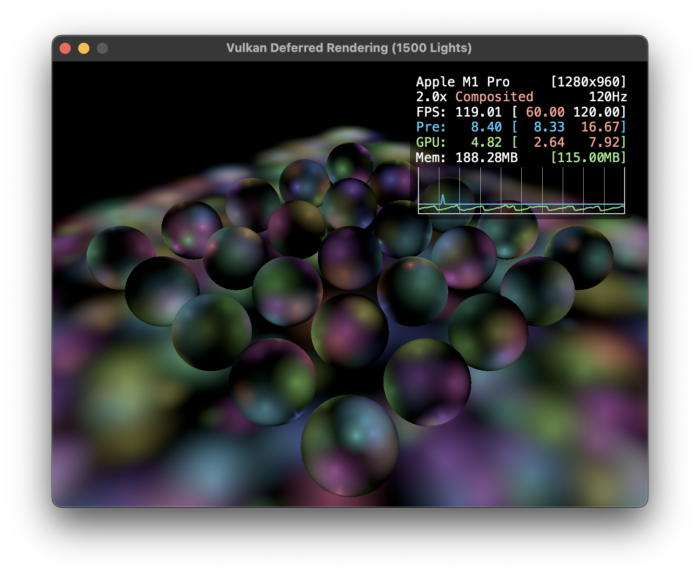
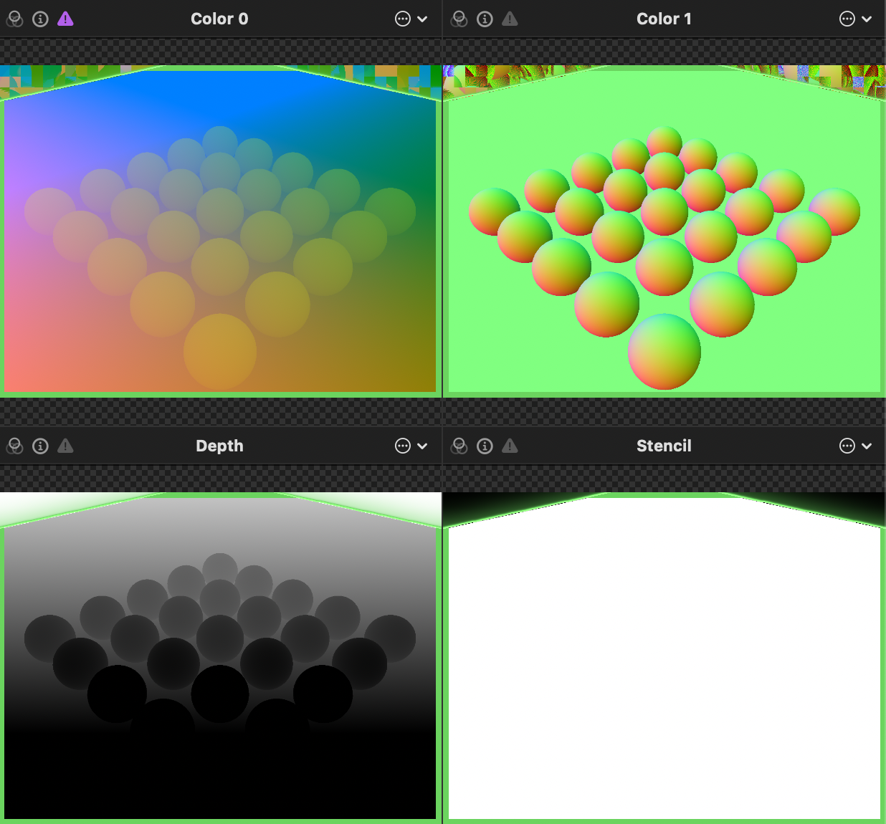
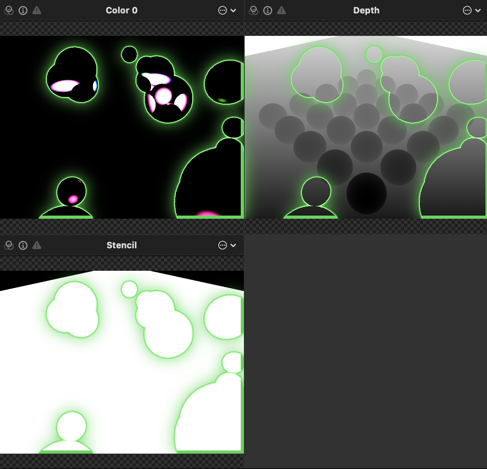
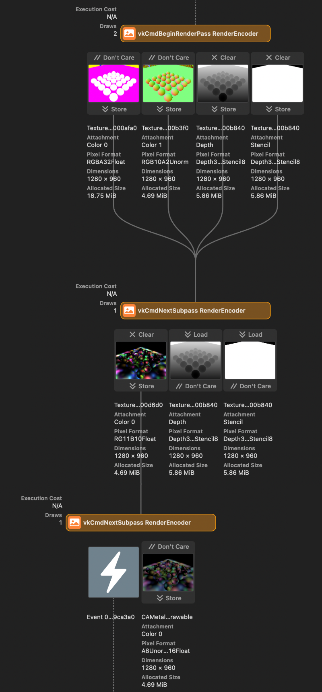

# vk-deferred




A minimal Vulkan deferred rendering demonstration.

## Usage

This project requires support for C++20 modules and the C++23 standard library. The supported compiler is:
- Clang 18.1.2
- MSVC 19.40

Additionally, the following build tools are required:
- CMake 3.30
- Ninja 1.11

### Dependencies

This project depends on:
- [GLFW](https://github.com/glfw/glfw)
- [glm](https://github.com/g-truc/glm)
- My own Vulkan-Hpp helper library, [vku](https://github.com/stripe2933/vku/tree/module) (branch `module`), which has the following dependencies:
  - [Vulkan-Hpp](https://github.com/KhronosGroup/Vulkan-Hpp)
  - [VulkanMemoryAllocator-Hpp](https://github.com/YaaZ/VulkanMemoryAllocator-Hpp)

Dependencies will be automatically fetched using vcpkg.

### Build Steps

> [!TIP]
> This project uses GitHub Runner to ensure build compatibility on Windows (with MSVC), macOS and Linux (with Clang). You can check the workflow files in the [.github/workflows](.github/workflows) folder.

This project, along with its dependency `vku`, supports vcpkg for dependency management. Follow these steps to build the project:

```sh
git clone https://github.com/stripe2933/vk-deferred
cd vk-deferred
cmake --preset=default # Or use your own configuration preset that inherits from the "default" preset.
cmake --build build -t vk-deferred
```

The executable will be located in the build folder.

### Shader compilation

All shaders are located in the [shaders](/shaders) folder and need to be manually compiled into `<shader-filename>.spv` before the application launch. To make this easier, script files are available for you:

- For bash users, run the [`compile.sh`](/shaders/compile.sh) script.
- For Windows users, run the [`compile.bat`](/shaders/compile.bat) batch file.

## About Render Pass and Attachment Images

Since Vulkan allows explicit management of resource usage and memory properties, all attachment images used only in the render pass can be created with `vk::ImageUsageFlagBits::eTransientAttachment`. Additionally, if the system uses a tile-based GPU, you can use `vk::MemoryPropertyFlagBits::eLazilyAllocated` to avoid expensive memory allocation for the entire image (only each tile region will be allocated when the image is accessed). Therefore, **the memory consumption of the G-buffer in Vulkan is zero-cost (only swapchain images are allocated)** on TBGPU, which is hard to be achieved in OpenGL.

The project has a render pass with three subpasses. Each subpass does the following:
1. **G-buffer construction**:
   The G-buffer stores the rendered meshes' position and normal (for simplicity, other fragment information like albedo and specular are not used) in the first and second color attachment images. It also uses the depth-stencil attachment to render depth and stencil=`1`.
   
2. **Lighting using light volume**:
   In this subpass, spheres corresponding to the light volumes are rendered (See [LearnOpenGL](https://learnopengl.com/Advanced-Lighting/Deferred-Shading) for details) only for fragments with stencil=`1`. The depth-stencil attachment is reused from the previous subpass, so light accumulation occurs only in previously rendered fragments. Since the swapchain attachments are in SRGB format, light cannot be accumulated directly (it should be done in the linear color space), so the `B10G11R11UfloatPack32` format is used for the color attachment (also preserving additional HDR info).
   
   Note: Only 20 light volumes are used in the above image to visualize the volume spheres. In the actual implementation, many more light volumes can be used.
3. **Tone mapping**:
   As mentioned earlier, the accumulated result is in HDR format, so it should be tone-mapped to the SRGB format. REC.709 tone mapping is used.

### Data Flow Visualization



Screenshot from Xcode Metal Debugger.

Note that the G-buffer's position and normal attachment images' `loadOp` are `eDontCare`, because only rendered fragments will be referenced in the next subpass due to the stencil test. Similarly, swapchain images have `loadOp=eDontCare` because all regions will be overwritten using a fullscreen quad.

## License

This project is licensed under the MIT License. See the [LICENSE](LICENSE.txt) file for details.